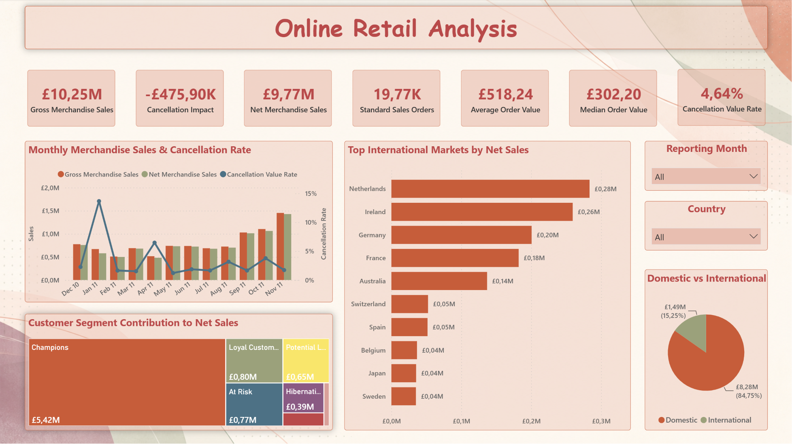
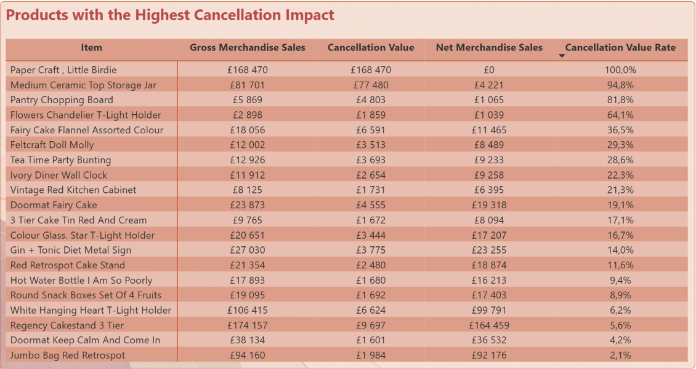
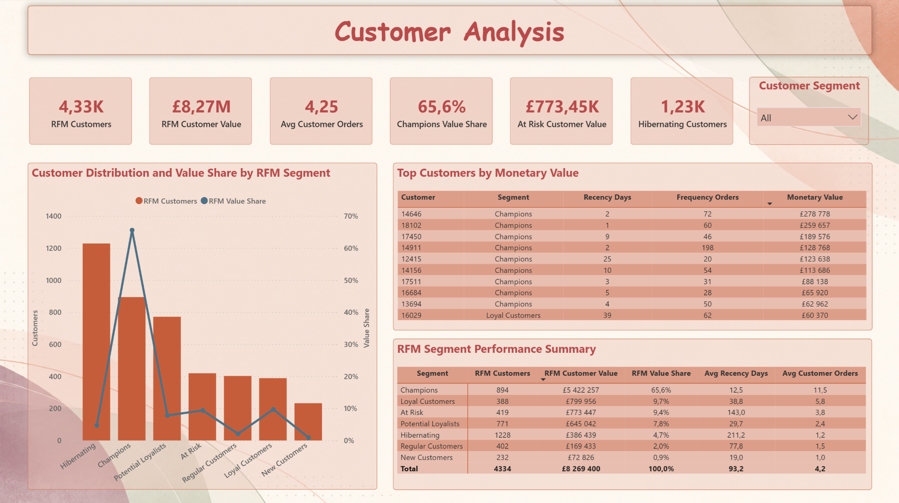
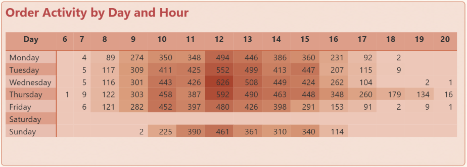
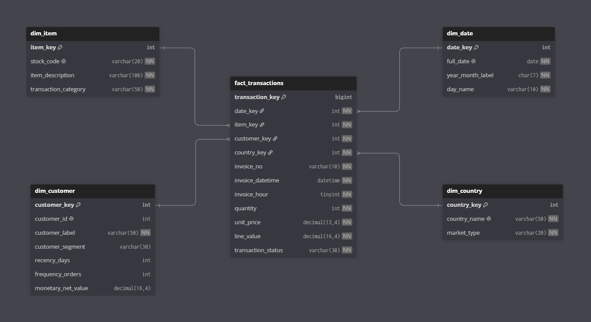

# Online Retail Sales Analysis


## 🧭 Project Background

This project analyzes transactional data from a UK-based online retailer. The source combines merchandise purchases with cancellations, inventory adjustments, shipping charges, discounts and other operational entries, making raw transaction value an unreliable measure of product sales.

The project addresses the following central business question:

> **Where is merchandise value generated, retained and lost across the retail business?**

Insights are provided across the following key areas:

- **Sales Performance:** Evaluation of gross and net merchandise sales, order value, sales retention and cancellation impact over time.
- **Product Performance:** Comparison of product sales, paid units and cancellation exposure, including investigation of extreme bulk transactions.
- **Customer Analysis:** RFM-based segmentation of identified customers using Recency, Frequency and Monetary Value.
- **Geographic Performance:** Comparison of domestic and international markets based on sales, order value and cancellation exposure.
- **Order Patterns:** Analysis of invoice activity by day and hour, with separate consideration of source-data coverage limitations.

The reporting model uses a star schema connecting transaction-level activity with product, customer, country and calendar dimensions. SQL performs data profiling, cleaning, classification, modelling and business analysis. Excel supports reconciliation, PivotTable analysis and customer lookup, while Power BI provides the final interactive reporting layer.

### Project Resources

- Power BI Dashboard is available [online](https://app.powerbi.com/links/G-9PEh4lpc?ctid=19504e94-d26c-473e-8da1-c2bdb363e8e8&pbi_source=linkShare&language=en-US), can be downloaded from the [repository](power_bi/gacha_monetization_dashboard.pbix) or shown as a [pdf](power_bi/gacha_monetization_dashboard.pdf).
- The Excel analysis workbook is available in the [`excel/`](excel/) directory.
- SQL scripts used for database setup, data cleaning, modelling, quality checks and business analysis are available in the [`sql/`](sql/) directory.
- The original dataset is available from the [UCI Machine Learning Repository](https://archive.ics.uci.edu/dataset/352/online%2Bretail).

## 📊 Executive Summary

The retailer recorded £10.25M in gross merchandise sales, with cancellations reducing value by £475.90K. This resulted in £9.77M in net merchandise sales and a 95.36% sales-retention rate. Performance strengthened between September and November 2011, with November reaching £1.43M in net merchandise sales—the highest result among complete months.

Value was highly concentrated. The United Kingdom generated 84.75% of net merchandise sales, while Champions represented 20.6% of segmented customers but contributed 65.6% of their total value. Average order value reached £518.24 compared with a median of £302.20, showing the influence of large wholesale transactions.

The analysis indicates that protecting high-value customers, re-engaging the At Risk segment and investigating products with concentrated cancellation exposure offer the clearest opportunities to retain merchandise value.



## 🔍 Key Insights

### Sales Performance

Monthly performance was uneven during the first half of the reporting period. Net merchandise sales fell to **£499.46K** in February and **£482.06K** in April, before remaining between approximately **£677K** and **£731K** from May to August 2011. Sales strengthened toward the end of the reporting period. Net merchandise sales increased from **£1.01M** in September to **£1.06M** in October and reached **£1.43M** in November 2011—the highest result among complete months.

Cancellation exposure was usually limited, but January and April stood out with cancellation value rates of **13.65%** and **6.46%**, respectively. December 2011 was excluded from month-to-month comparisons because the dataset covers only its first nine days.
### Product Cancellation Exposure

Cancellation impact was highly concentrated among a small number of products and transactions. `PAPER CRAFT, LITTLE BIRDIE` recorded **£168.47K** in gross sales followed by an equal cancellation, leaving no net merchandise value. Both entries related to a single bulk transaction of **80,995 units**.

`MEDIUM CERAMIC TOP STORAGE JAR` generated **£81.70K** in gross sales but retained only **£4.22K** after cancellations, producing a cancellation value rate of **94.8%**. These results show that the highest product-level cancellation rates were strongly influenced by exceptional bulk transactions and should not be interpreted as direct evidence of poor product quality.



### Customer Value and RFM Segmentation

Customers were segmented using quintile-based Recency, Frequency and Monetary scores, where higher scores represented more recent, frequent and valuable purchasing behaviour.

Customer value was strongly concentrated. Champions accounted for **894 customers**, representing **20.6%** of the segmented population, but generated **£5.42M** or **65.6%** of identified-customer value.

The At Risk segment contained **419 customers** with **£773.45K** in historical net value, making it the clearest reactivation priority. Hibernating was the largest segment with **1,228 customers**, but contributed only **£386.44K**, or **4.7%** of customer value.




### Geographic Performance

The United Kingdom generated **£8.28M** in net merchandise sales and accounted for **84.75%** of total value, demonstrating strong dependence on the domestic market.

The Netherlands was the largest international market with **£283.48K** in net sales, followed by Ireland at **£259.38K** and Germany at **£200.62K**. Several international markets combined high average order values with relatively few orders, indicating that their performance was partly dependent on large wholesale transactions rather than broad order volume.

### Order Patterns and Data Coverage

Invoice activity was concentrated between late morning and mid-afternoon, with **12:00** recording the highest order volume. Wednesday at **12:00** was the busiest individual day-hour combination.

No Saturday invoices occur in the raw source, clean view or final fact table. This absence was therefore not introduced during data preparation. Invoice timestamps may represent document processing rather than the exact moment of online purchase, so order-pattern results should not be interpreted as direct website-traffic behaviour.



## 💡 Recommendations

1. **Protect high-value customer relationships.** Champions generate most identified-customer value, so the retailer should monitor declines in their purchasing frequency and use targeted retention activities rather than broad discount campaigns.

2. **Prioritize the At Risk segment for reactivation.** These customers have meaningful historical value but have not purchased recently. Targeted campaigns should be tested against a control group to determine whether incentives generate incremental sales.

3. **Review exceptional cancellations individually.** Products with the largest cancellation impact were strongly affected by a small number of bulk transactions. The retailer should investigate the underlying orders, customer context and fulfilment process before making product-level decisions.

4. **Introduce additional controls for unusually large orders.** Quantity thresholds or manual approval may reduce the operational and reporting impact of exceptional transactions that are later cancelled.

5. **Develop proven international markets selectively.** The Netherlands, Ireland and Germany show the strongest international sales, but expansion decisions should consider order volume and customer concentration—not sales value alone.

6. **Use median order value alongside the average.** Large wholesale orders materially increase the mean, so both measures should be monitored to distinguish typical customer behaviour from exceptional transactions.

7. **Clarify the meaning of invoice timestamps.** Before using order-hour patterns for staffing or marketing decisions, the retailer should confirm whether timestamps represent customer purchases or subsequent invoice processing.

## ⚙️ Technical Workflow

### 1. SQL — Data Preparation and Modelling

The original Excel dataset was converted to CSV and loaded into a MySQL staging table without modifying the source values. SQL was then used to:

- audit missing values, invalid formats, cancellations and zero-price records;
- identify potential duplicate transaction lines without permanently deleting source data;
- classify merchandise, shipping, discounts, fees and operational adjustments;
- standardize data types and create canonical product descriptions;
- build a star schema containing `fact_transactions`, `dim_date`, `dim_item`, `dim_customer` and `dim_country`;
- create analytical views for order-level reporting and RFM customer segmentation;
- validate row counts, monetary totals and key relationships between each transformation stage.

### 2. Excel — Validation and Business Exploration

Excel was connected directly to the MySQL analytical views. Power Query, PivotTables and formulas were used to:

- compare monthly sales and cancellation performance;
- review RFM segment results;
- validate SQL outputs against independent Excel calculations;
- create an interactive customer lookup with `XLOOKUP`;
- explore results before building the final Power BI report.

### 3. Power BI — Reporting and Visualization

Power BI was connected to the final SQL model and used to build four report pages:

- **Sales Overview** — headline KPIs, monthly performance, markets and customer contribution;
- **Product Performance** — product sales, units and cancellation exposure;
- **Customer Analysis** — RFM segment size, value and customer-level details;
- **Order Patterns** — order activity by hour, weekday and customer segment.

DAX measures were used for filter-responsive KPIs, while the core cleaning rules, classifications and reusable business logic remained in SQL.

## 🗂️ Data Model

The final analytical model follows a star schema centred on `fact_transactions`, where each row represents a cleaned transaction line.

- `dim_date` provides calendar attributes for time analysis.
- `dim_item` contains standardized product descriptions and transaction categories.
- `dim_customer` identifies known customers and preserves a separate label for unidentified records.
- `dim_country` supports domestic and international market analysis.

Additional SQL views aggregate the model to order level and calculate RFM customer metrics used in Excel and Power BI.



## ⚠️ Limitations

- The dataset ends on **9 December 2011**, so this month was excluded from monthly performance comparisons.
- Cancellation records indicate reversed invoice value but do not confirm the reason for cancellation or whether a physical product return occurred.
- Product costs are unavailable; therefore, the project analyzes sales value rather than profit or margin.
- Customer IDs are missing from part of the dataset, so RFM analysis covers only identified customers.
- Identical transaction lines were flagged as duplicate candidates rather than treated as confirmed errors. The clean analytical model retains one primary record per identical group, while the source data remains unchanged for traceability.
- Large wholesale transactions materially affect averages, unit volumes and product-level cancellation rates.
- Invoice timestamps may represent document processing rather than the exact time of an online purchase.
- No Saturday invoices occur in the source data, but the dataset does not explain the underlying operational reason.

## 📁 Repository Structure

```text
online-retail-sales-analysis/
│
├── data/
│   ├── raw/
│   └── sample/
│
├── docs/
├── excel/
│   └── online_retail_analysis.xlsx
│
├── images/
├── power-bi/
│   └── online_retail_analysis.pbix
│
├── sql/
│   ├── 01_database_setup/
│   ├── 02_data_cleaning/
│   ├── 03_data_model/
│   ├── 04_analysis/
│   └── 05_quality_checks/
│
├── .gitattributes
├── .gitignore
└── README.md
```

- [`data/`](data/) — source-data information and a portfolio-friendly sample of the dataset.
- [`docs/`](docs/) — supporting project documentation.
- [`excel/`](excel/) — the Excel validation and business-exploration workbook.
- [`images/`](images/) — dashboard pages and data-model screenshots used in this README.
- [`power-bi/`](power-bi/) — the interactive Power BI report and its visual assets.
- [`sql/`](sql/) — database setup, data cleaning, modelling, quality checks and business-analysis queries.
